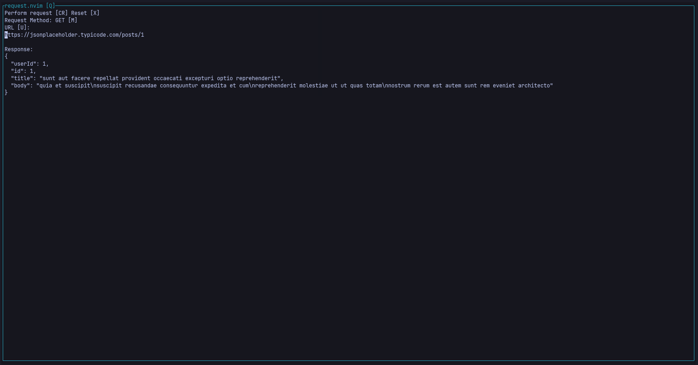

# request.nvim
Why should you need to leave your favorite editor to make API requests?  
A neovim api request client written in Lua



## Documentation
See also `:help request.nvim`.

### Setup
If you're using [Lazy.nvim](https://github.com/folke/lazy.nvim)
```lua
{
-- other plugins
    "kongreif/request.nvim",
-- other plugins
}
```

### UI
Open the request.nvim window via `:Request`.  
Command keys are shown in `[ ]`, e.g. `[U]` to start inserting the request URL.  
Hitting `Enter` will perform the request and show the response.

The params are expected in valid JSON.

Supports GET, POST, PUT, PATCH, and DELETE requests.

### Commands
You can try out the [commands](https://github.com/kongreif/request.nvim/blob/main/lua/request/commands.lua) in Neovim's command mode like this:
```lua
:lua print(require("request").get("https://jsonplaceholder.typicode.com/posts/1"))
-- {
--   "userId": 1,
--   "id": 1,
--   "title": "sunt aut facere repellat provident occaecati excepturi optio reprehenderit",
--   "body": "quia et suscipit\nsuscipit recusandae consequuntur expedita et cum\nreprehenderit molestiae ut ut quas totam\nnostrum rerum est autem sunt rem eveniet architecto"
-- }

:lua print(require("request").post("https://jsonplaceholder.typicode.com/posts", { userId = 1, title = 'request.nvim', body = 'btw' }))
-- {
--   "title": "request.nvim",
--   "body": "btw",
--   "userId": "1",
--   "id": 1
-- }

:lua print(require("request").put("https://jsonplaceholder.typicode.com/posts/1", { userId = 1, title = 'request.nvim', body = 'btw' }))
-- {
--   "title": "request.nvim",
--   "body": "btw",
--   "userId": "1",
--   "id": 1
-- }

:lua print(require("request").patch("https://jsonplaceholder.typicode.com/posts/1", { title = 'request.nvim' }))
-- {
--   "userId": 1,
--   "id": 1,
--   "title": "request.nvim",
--   "body": "quia et suscipit\nsuscipit recusandae consequuntur expedita et cum\nreprehenderit molestiae ut ut quas totam\nnostrum rerum est autem sunt rem eveniet architecto"
-- }

:lua print(require("request").delete("https://jsonplaceholder.typicode.com/posts/1", { userId = 1, title = 'foo', body = 'bar' }))
-- {}
```

## Contributing
### Clone the repo
```bash
git clone https://github.com/kongreif/request.nvim
cd request.nvim
```
### Add it to your packages
E.g.
```lua
"kongreif/request.nvim",
```
###  Run tests
Run tests in `/tests` via [plenary's test framework](https://github.com/nvim-lua/plenary.nvim/blob/master/TESTS_README.md).
### Submit a pull request
If you'd like to contribute, please fork the repository and open a pull request to the `main` branch.
